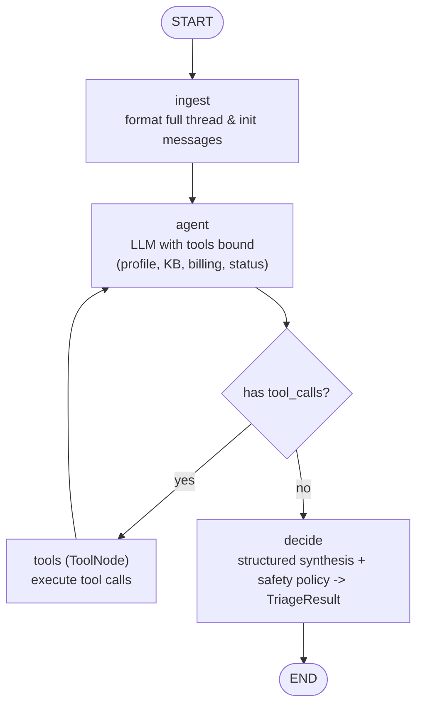

# Support Ticket Triage Agent


ReAct triage agent for customer-support tickets: classify urgency, extract product / issue / sentiment, search a knowledge base, and decide the next action (`auto-respond` / `route to specialist` / `escalate to human`). Runs as a terminal console **and** a FastAPI HTTP service — no chat UI.

Supports **OpenAI (default)** and **Gemini** via `LLM_PROVIDER`. No API key is bundled — bring your own.

[Overview](#overview) • [Features](#features) • [How it works](#how-it-works) • [Getting started](#getting-started) • [Run](#run) • [API](#api-fastapi) • [Postman](#postman) • [Testing](#testing) • [Project structure](#project-structure) • [Troubleshooting](#troubleshooting)

## Overview

An AI agent that processes multi-message ticket threads (including Thai input), gathers facts with tools, and returns a structured `TriageResult` with reasoning and confidence.

Sample tickets and typical LLM-path results (the LLM decides the action — no regex guard forces escalation, so exact outputs can vary with model/version):

| Ticket | Thread | Expected |
|---|---|---|
| `ticket-1-billing` (Free, 3x $29.99 pending, dispute threat, presentation in 2h) | billing + access | `critical` / `escalate to human` |
| `ticket-2-outage` (Enterprise 45 seats, Thai, error 500, Asia region) | outage + status-check | `critical` / `escalate to human` |
| `ticket-3-darkmode` (Pro, friendly, macOS display bug + feature request) | bug + feature-request | `medium` / `route to specialist` |

> [!NOTE]
> Without an LLM key (or on LLM/schema error) every ticket instead fail-closes to `high` / `escalate to human` at confidence 0.5 with `unknown` fields — see Features above.

See `docs/writeup.md` for architecture decisions, failure modes, and production eval; `docs/assignment-summary.md` for the assignment source summary.

## Features

- **Urgency classification** — `critical` / `high` / `medium` / `low`, weighing business impact and deadline over plan tier.
- **Multi-intent extraction** — product, `issue_types[]`, sentiment across the full thread (English and Thai input, English-only output).
- **Knowledge-base grounding** — keyword search over 6 FAQ entries, cited as `kb_refs[]` (capped at top-2).
- **LLM-decided actions + confidence floors** — `decide` trusts the LLM's `next_action`/`urgency`; it only applies confidence floors (`escalate` ≥0.95, `route to specialist` ≥0.8, `auto-respond` ≥0.9, fallback branch ≥0.7) and appends a ≤300-char billing/status evidence excerpt to `reasoning`. No regex escalation guard — outage/billing/dispute wording alone never forces escalation (see `tests/test_nodes.py`).
- **4 mock tools** — `get_customer_profile`, `search_knowledge_base`, `check_system_status`, `check_billing` (no network, no key needed).
- **Fail-closed fallback** — no key or LLM error → every ticket `escalate to human` at confidence 0.5 with `urgency: high`, `product` / `issue_types` / `sentiment` as `unknown` (customer profile quoted in reasoning, no billing/status/KB lookups), never auto-responds.
- **FastAPI service** — `POST /triage` (single) + `POST /triage/batch` (many), `GET /tickets/samples`, `GET /health`, and direct `GET /tools/*` mock-tool checks; interactive docs at `/docs`, Postman collection included.

## How it works

ReAct `StateGraph`: `ingest → agent <-> tools (ToolNode) → decide → END`.



- `ingest` joins the full thread (timestamps preserved) into initial agent messages.
- `agent` binds the 4 mock tools to `ChatOpenAI` / `ChatGoogleGenerativeAI` and loops through `ToolNode` until no more `tool_calls`.
- `decide` synthesizes the full message history via `finalize_prompt` with structured output (`TriageResult`), trusts the LLM's `next_action`/`urgency` (confidence floors only, see above), and caps `kb_refs` at top-2 (deduped, order-preserved; `TriageResult` validators also normalize `product`/`issue_types`/`sentiment` and clamp `confidence`).

The FastAPI layer (`triage_agent/api.py`) is a thin stateless wrapper: it validates the HTTP payload (Pydantic), converts it to the internal ticket dict, and calls the same `run_ticket()` the console runner uses (via `asyncio.to_thread` so the event loop never blocks on the sync LangGraph run).

> [!NOTE]
> The global status page can be stale (`all systems operational`). The per-region check is authoritative (`asia: degraded`).

## Getting started

Prerequisites: Python 3.12+, `pip`, a terminal. Optional: Docker, LangGraph CLI.

```bash
python3 -m venv .venv && source .venv/bin/activate
pip install -e ".[test]"  # dev: version ranges from pyproject.toml + pytest
cp .env.example .env  # then fill in your own key; never commit .env
```

### Dependencies: `pyproject.toml` + `requirements.txt` (used together)

| File | Role | When it is used |
|---|---|---|
| `pyproject.toml` | Source of truth — version ranges (`>=`), metadata, test extras | Local dev, install with `pip install -e ".[test]"` |
| `requirements.txt` | Lockfile — pinned versions (`==`) | Docker / production, install with `pip install -r requirements.txt` |

Edit dependencies in `pyproject.toml` only, then regenerate the lockfile:

```bash
.venv/bin/pip install -e . && .venv/bin/pip freeze | grep -Ei '^(langchain-core|langgraph|langchain-openai|langchain-google-genai|pydantic|python-dotenv|fastapi|uvicorn)==.*' > requirements.txt
```

### Configuration

| Variable | Default | Description |
|---|---|---|
| `LLM_PROVIDER` | `openai` | `openai` or `gemini` (unknown values warn + fall back to `openai`) |
| `OPENAI_API_KEY` / `OPENAI_MODEL` | `gpt-6-luna` | OpenAI path |
| `GOOGLE_API_KEY` / `GEMINI_MODEL` | `gemini-3.1-flash-lite` | Gemini path |
| `LANGSMITH_TRACING` / `LANGSMITH_API_KEY` | unset | Optional tracing (needs `pip install -e ".[observability]"` for `langsmith`) |
| `BATCH_CONCURRENCY` | `4` | Max parallel graph runs per `/triage/batch` (clamped 1–8) |
| `TRIAGE_TIMEOUT_S` | `120` | Per-ticket graph timeout (invalid → 120) |
| `RATE_LIMIT_PER_MIN` | `120` | Per-IP limit on `POST /triage*` + `/v1/triage*` (`0` disables, bad value → 120, excess → `429`) |
| `ALLOWED_ORIGINS` | `*` | Comma-separated CORS origins (dev open; set explicit origins in prod) |
| `TRIAGE_API_KEY` / `API_KEY` | unset | Optional shared-secret auth (`x-api-key` header; unset = open) |

> [!IMPORTANT]
> Export the file before running — the code reads `os.getenv` directly:
> `set -a; source .env; set +a`

> [!WARNING]
> No key → degraded fallback: no real classification, every ticket `escalate to human` at confidence 0.5 with `product` / `issue_types` / `sentiment` as `unknown`. Set a provider key to enable the real LLM path.

## Run

Console runner (triages the 3 sample tickets, prints each `TriageResult` as JSON):

```bash
set -a; source .env; set +a
.venv/bin/python -m triage_agent
```

Docker (console only, no ports):

```bash
docker build -t triage-agent .
docker run --rm --env-file .env triage-agent
```

Or with Compose (same console behavior, no ports):

```bash
docker compose run --rm triage-agent
```

## API (FastAPI)

Live HTTP service for triaging tickets without the console runner — same `run_ticket()` graph, wrapped in a stateless REST layer (`triage_agent/api.py`, CORS open, Swagger at `/docs`). Root `app.py` is the direct entrypoint: it re-exports `app`, loads `.env` automatically, and adds `--host/--port/--reload` flags (defaults from `HOST`/`PORT` env):

```bash
.venv/bin/python app.py --reload --port 8000
# docs: http://localhost:8000/docs
# alt: .venv/bin/uvicorn app:app --reload --port 8000
# alt: .venv/bin/uvicorn triage_agent.api:app --reload --port 8000
# alt (no uvicorn CLI): .venv/bin/python -m triage_agent.api
```

Or with Compose (API on port 8000, console service stays port-less):

```bash
docker compose up api
```

Endpoints:

| Method | Path | Description |
|---|---|---|
| `GET` | `/` | Service map (links to `/docs`, `/health`, endpoint list) |
| `GET` | `/health` (`/v1/health` alias) | Liveness + `llm_provider` / `llm_configured` status |
| `GET` | `/tickets/samples` | The 3 sample tickets already shaped as `TriageRequest` (`{count, tickets[]}`) — copy-paste into `POST /triage` |
| `POST` | `/triage` (`/v1/triage` alias) | Triage one ticket (`{id, customer_id, messages: [{timestamp, text}]}`) → `{ticket_id, llm_provider, llm_configured, result}` (max 20k chars/ticket) |
| `POST` | `/triage/batch` (`/v1/triage/batch` alias) | Triage many tickets (`{tickets: [...]}` max 20, max 60k chars/batch) → `{count, ok, errors, results: [{ticket_id, result} \| {ticket_id, error}]}` (parallel fan-out, order preserved, per-item errors never abort the batch) |
| `GET` | `/tools/profile?customer_id=` | Direct mock-tool check (no key needed) |
| `GET` | `/tools/billing?customer_id=` | Direct mock-tool check |
| `GET` | `/tools/status?region=asia` | Direct mock-tool check |
| `GET` | `/tools/kb?query=` | Direct mock-tool check (query max 2000 chars) |

### Quickstart

1. Check the service and LLM key status:

```bash
curl -s http://localhost:8000/ | jq .
curl -s http://localhost:8000/health | jq .
# {"status":"ok","llm_provider":"openai","llm_configured":true}
# llm_configured=false → every /triage fail-closes to escalate to human (confidence 0.5), same as the console runner
```

2. Fetch a sample, then triage a single ticket (`ticket-2-outage`, Thai input):

```bash
curl -s http://localhost:8000/tickets/samples | jq '.tickets[1]'
curl -s -X POST http://localhost:8000/triage \
  -H 'Content-Type: application/json' \
  -d '{"id":"ticket-2-outage","customer_id":"cust_ent_th_045","messages":[
    {"timestamp":"2h ago","text":"ระบบเข้าไม่ได้ครับ ขึ้น error 500"},
    {"timestamp":"just now","text":"status page says operational but Asia region seems down, demo this afternoon (บ่ายนี้)"}
  ]}' | jq .
```

3. Triage multiple tickets at once:

```bash
curl -s -X POST http://localhost:8000/triage/batch \
  -H 'Content-Type: application/json' \
  -d '{"tickets":[
    {"id":"ticket-1-billing","customer_id":"cust_free_001","messages":[
      {"timestamp":"1h ago","text":"I have THREE charges of $29.99, none refunded, still no Pro access."},
      {"timestamp":"just now","text":"Presentation in 2 hours. If not reversed by end of day I will dispute them."}]},
    {"id":"ticket-3-darkmode","customer_id":"cust_pro_123","messages":[
      {"timestamp":"today","text":"Dark mode on macOS stays light on System Default - bug? Also schedule auto-switch at 6pm?"}]}
  ]}' | jq .
```

4. Call mock tools directly (no LLM key needed — useful for debugging / demoing grounding):

```bash
curl -s 'http://localhost:8000/tools/profile?customer_id=cust_free_001' | jq .
curl -s 'http://localhost:8000/tools/billing?customer_id=cust_free_001' | jq .
curl -s 'http://localhost:8000/tools/status?region=asia' | jq .
curl -s 'http://localhost:8000/tools/kb?query=duplicate%20charge%20refund' | jq .
```

Call from Python (service must be running):

```python
import requests

ticket = {
    "id": "ticket-1-billing",
    "customer_id": "cust_free_001",
    "messages": [{"timestamp": "just now", "text": "THREE charges of $29.99, no Pro access, disputing today"}],
}
r = requests.post("http://localhost:8000/triage", json=ticket, timeout=120)
r.raise_for_status()
print(r.json()["result"])  # TriageResult dict: urgency, product, issue_types, ..., confidence
```

Errors to know:

| Status | When | Example |
|---|---|---|
| `401` | `TRIAGE_API_KEY` set but `x-api-key` header missing/wrong | `{"detail":"invalid or missing api key"}` |
| `422` | Invalid payload schema / empty or blank `messages`, blank `customer_id`, oversize single ticket (>20k chars), oversize batch (>20 tickets or >60k chars) or message (>4000 chars) | `{"messages": []}` → validation error |
| `502` | Single-ticket triage crashed or timed out (`TRIAGE_TIMEOUT_S`) — not the normal fallback | `triage failed: ...` / `triage timed out` (the no-key fallback still returns `200` with `escalate to human`; batch per-item failures return `200` with `{ticket_id, error}` entries instead) |

> [!NOTE]
> `POST /triage*` runs the sync LangGraph in `asyncio.to_thread(run_ticket, …)` — the event loop never blocks; batch fans out in parallel (concurrency via `BATCH_CONCURRENCY`, default 4) with order preserved. Every response carries an `X-Request-ID` header and the server logs method/path/status/latency.

## Postman

Import `postman_collection.json` (variable `baseUrl` defaults to `http://localhost:8000`):

1. **1 - Meta** — `GET /`, `/health`, `/tickets/samples`
2. **2 - Triage samples** — `POST /triage` with ticket-1 (billing), ticket-2 (Thai outage), ticket-3 (dark mode)
3. **3 - Custom + batch** — custom ticket, `POST /triage/batch` (all 3), invalid-payload case (`422`)
4. **4 - Mock tools** — direct `/tools/*` checks (work even with no LLM key)

LangGraph Studio / deploy config (`langgraph.json` exposes `triage_agent` graph from `./triage_agent/agent.py:app`, env from `./.env`):

```bash
langgraph dev  # or: langgraph up
```

Programmatic use:

```python
from triage_agent.agent import run_ticket
result = run_ticket({"id": "...", "customer_id": "cust_free_001", "messages": [...]})
print(result.to_dict())
```

Example output (truncated):

```json
{
  "urgency": "critical",
  "product": "billing",
  "issue_types": ["billing", "access"],
  "sentiment": "negative",
  "kb_refs": ["kb-billing-duplicate", "kb-upgrade-pro-access"],
  "next_action": "escalate to human",
  "confidence": 0.95
}
```

> [!TIP]
> The Gemini path disables SDK-side automatic function calling (`AutomaticFunctionCallingConfig(disable=True)`) after `with_structured_output` to silence the `google-genai` AFC warning. LangChain runs its own tool loop, so SDK-side AFC stays off — 0 warnings on stderr.

## Testing

```bash
.venv/bin/python -m pytest -q
```

Covers graph compilation, fail-closed fallback (all tickets `high` / escalate at 0.5 with no key), ReAct routing (`tools` vs `decide`), `decide` LLM-trust policy (outage/billing/dispute wording alone never forces escalation; bug → specialist; negated-dispute → no false escalation), all 4 mock tools (incl. Thai KB queries), the LLM path via a fake ChatModel (billing escalates, bug routes, schema violation fail-closes, Thai paraphrases trust the LLM), CLI output for the 3 sample tickets, and the FastAPI layer (`/health`, `/tickets/samples`, `POST /triage` + `/triage/batch` incl. `422` empty/blank/oversize cases, no-key `escalate to human` fallback, batch partial-failure isolation + order preservation, `X-Request-ID` header, rate-limit `429`, `GET /tools/*`). For manual exploration use `/docs` try-it-out or the Postman collection.

## Project structure

```text
app.py                # root FastAPI entrypoint (`python app.py`, re-exports triage_agent.api:app)
triage_agent/
  agent.py            # build_graph, compiled app, run_ticket
  api.py              # FastAPI service (POST /triage, /triage/batch, GET /health, /tickets/samples, /tools/*)
  prompts.py          # REACT_AGENT_SYSTEM_PROMPT + FINALIZE_SYSTEM_PROMPT/finalize_prompt (English-only output, prompt-injection guard, KB-ID grounding rule)
  sample_tickets.py   # 3 sample threads (timestamps kept, Thai kept for ticket 2)
  __main__.py         # console runner (prints TriageResult JSON per ticket)
  utils/
    state.py          # TicketState (TypedDict) + TriageResult (Pydantic output schema + normalizing validators)
    nodes.py          # ingest / agent / decide nodes + degraded fallback + Gemini AFC workaround (fresh ChatModel per call, no key caching)
    tools.py          # 4 mock tools as @tool objects (never raise, return model-readable strings)
    mock_data.py      # 3 customers, billing charges, region status, 6 KB entries (EN + Thai keywords)
docs/
  writeup.md          # architecture, failure modes, production eval (+ §4 API exposure)
  assignment-summary.md # assignment source summary
postman_collection.json # Postman: meta → triage samples → custom/batch → mock tools
compose.yaml          # triage-agent (console, no ports) + api (uvicorn :8000)
Dockerfile            # pip install -r requirements.txt, EXPOSE 8000, default CMD console
tests/
  test_graph.py test_nodes.py test_tools.py test_api.py test_llm_path.py
```

## Troubleshooting

| Symptom | Cause / fix |
|---|---|
| All tickets `escalate to human`, confidence 0.5, fields `unknown` | Degraded fallback — no/invalid key. Check `LLM_PROVIDER` matches the key you set (`OPENAI_API_KEY` vs `GOOGLE_API_KEY`) and that `.env` is exported. Same over HTTP: `/health` shows `llm_configured: false`, `/triage` still returns `200` with fallback result. |
| `POST /triage` → `422 messages must not be empty` | Empty `messages[]` (or empty `tickets[]` on batch). Send at least 1 message; see `GET /tickets/samples` for valid shape. |
| `POST /triage` → `502 triage failed…` | Exception inside `run_ticket` (not the normal no-key fallback). Check server logs; retry — batch captures per-ticket errors inline (`{ticket_id, error}`) without aborting. |
| `POST /triage*` → `429 rate limit exceeded` | Too many triage calls from one IP. Wait a minute or raise `RATE_LIMIT_PER_MIN` (`0` disables). |
| Port `8000` already in use / `docker compose up api` won't start | Another uvicorn running — stop it or remap (`.venv/bin/python app.py --port 8001`, update Postman `baseUrl`). |
| `automatic function calling` warnings on stderr (Gemini) | Outdated workaround — `nodes.py:_with_structured_output_no_afc` should bind `AutomaticFunctionCallingConfig(disable=True)`. |
| `Customer not found` / `Unknown region` / `No matching articles` in reasoning | Mock-data miss — tools return strings, never raise; the LLM still decides the action (`decide` applies no regex guard). Check `mock_data.py` ids/regions. |
| `ModuleNotFoundError: langchain_*` | Venv not installed — run `pip install -e .` inside `.venv`. The fallback path alone runs on stdlib, the LLM path needs deps. |
