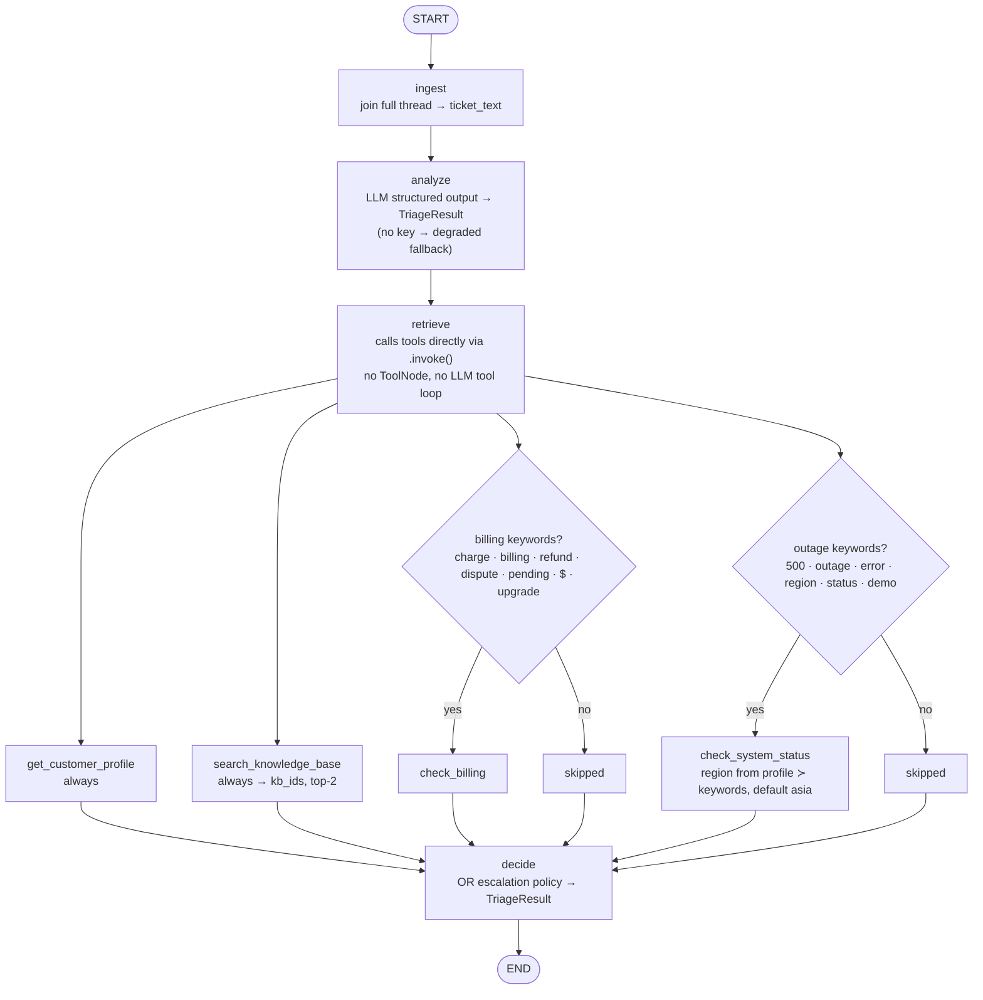

# Support Ticket Triage Agent

LangChain + LangGraph triage agent for incoming customer-support tickets: classify urgency, extract product / issue / sentiment, search a knowledge base, and decide the next action (`auto-respond` / `route to specialist` / `escalate to human`). Terminal console only — no chat UI.

Supports **OpenAI (default)** and **Gemini** via `LLM_PROVIDER`. No API key is bundled — bring your own.

[Features](#features) • [How it works](#how-it-works) • [Getting started](#getting-started) • [Run](#run) • [Project structure](#project-structure) • [Troubleshooting](#troubleshooting)

## Features

- **Urgency classification** — `critical` / `high` / `medium` / `low`, weighing impact and deadline over plan tier.
- **Multi-intent extraction** — product, `issue_types[]`, sentiment + `sentiment_trajectory` across the full thread (English and Thai input, English-only output).
- **Knowledge-base grounding** — keyword search over 6 FAQ entries, cited as `kb_refs[]` (capped at top-2).
- **Deterministic decisions** — OR escalation policy (dispute threat, unrefunded money + deadline, org/region outage) applied over LLM analysis + tool evidence.
- **4 mock tools** — `get_customer_profile`, `search_knowledge_base`, `check_system_status`, `check_billing` (no network, no key needed).
- **Fail-closed fallback** — no key or LLM error → every ticket `escalate to human` at confidence 0.5, never auto-responds.

## How it works

Linear LangGraph `StateGraph`: `ingest → analyze → retrieve → decide → END` (no branches, no ReAct loop).



> [!NOTE]
> LangGraph Studio (`langgraph dev`) shows only the 4 nodes — tools are invisible there by design. They are plain deterministic function calls inside the `retrieve` node (`nodes.py:130`), not graph nodes: no `ToolNode`, no `bind_tools`, no agentic loop. The LLM in `analyze` never calls a tool; the "tool-use policy" in `SYSTEM_PROMPT` just describes what `retrieve` then executes in code. Final `kb_refs` always come from the real `search_knowledge_base` call (`kb_ids`), not from the LLM's guess — `decide` overwrites them.

- `analyze` uses `triage_prompt | llm.with_structured_output(TriageResult, method="json_schema")`, temperature 0.
- `retrieve` calls tools directly (no `ToolNode` loop). Billing triggers on `charge / billing / refund / dispute / pending / $ / upgrade`; outage triggers on `500 / outage / error / region / status / demo` (+ Thai `เข้าไม่ได้ / โวย`).
- `decide` escalates on dispute threat, pending charges + deadline, or degraded region + error 500; `low` urgency → `auto-respond`; otherwise → `route to specialist`.

> [!NOTE]
> The global status page can be stale (`all systems operational`). The per-region check is authoritative (`asia: degraded`).

Sample tickets and expected LLM-path results:

| Ticket | Thread | Expected |
|---|---|---|
| `ticket-1-billing` (Free, 3× $29.99 pending, dispute threat, presentation in 2h) | billing + access | `critical` / `escalate to human` |
| `ticket-2-outage` (Enterprise 45 seats, Thai, error 500, Asia region) | outage + status-check | `critical` / `escalate to human` |
| `ticket-3-darkmode` (Pro, friendly, no rush) | bug + feature-request | `low` / `auto-respond` |

See `docs/writeup.md` for architecture decisions, failure modes, and production eval; `docs/assignment-summary.md` for the assignment source summary.

## Getting started

Prerequisites: Python 3.12+, `pip`, a terminal. Optional: Docker, LangGraph CLI.

```bash
python3 -m venv .venv && source .venv/bin/activate
pip install -e .   # required for the LLM path; mocks + degraded fallback run on stdlib
cp .env.example .env  # then fill in your own key; never commit .env
```

### Configuration

| Variable | Default | Description |
|---|---|---|
| `LLM_PROVIDER` | `openai` | `openai` or `gemini` |
| `OPENAI_API_KEY` / `OPENAI_MODEL` | `gpt-6-luna` | OpenAI path |
| `GOOGLE_API_KEY` / `GEMINI_MODEL` | `gemini-3.1-flash-lite` | Gemini path |
| `LANGSMITH_TRACING` / `LANGSMITH_API_KEY` | unset | Optional tracing |

> [!IMPORTANT]
> Export the file before running — the code reads `os.getenv` directly:
> `set -a; source .env; set +a`

> [!WARNING]
> No key → degraded fallback: no real classification, every ticket `escalate to human` at confidence 0.5 with `product` / `issue_types` / `sentiment` as `unknown`. Set a provider key to enable the real LLM path.

## Run

Console runner (triages the 3 sample tickets, prints each `TriageResult` as JSON):

```bash
set -a; source .env; set +a
.venv/bin/python -m triage_agent
```

Docker (console only, no ports):

```bash
docker build -t triage-agent .
docker run --rm --env-file .env triage-agent
```

LangGraph deploy config (`langgraph.json` exposes `triage_agent` graph from `./triage_agent/agent.py:app`, env from `./.env`):

```bash
langgraph dev  # or: langgraph up
```

Programmatic use:

```python
from triage_agent.agent import run_ticket
result = run_ticket({"id": "...", "customer_id": "cust_free_001", "messages": [...]})
print(result.to_dict())
```

> [!TIP]
> Gemini path binds `AutomaticFunctionCallingConfig(disable=True)` after `with_structured_output` to silence the `google-genai` SDK AFC warning (see `langchain-ai/langchain-google` PR #1980). LangChain runs its own tool loop, so SDK-side AFC stays off — 0 warnings on stderr.

## Project structure

```text
triage_agent/
  agent.py            # build_graph, compiled app, run_ticket
  prompts.py          # SYSTEM_PROMPT + triage_prompt (locked: English-only output, tool policy, 3 few-shots)
  sample_tickets.py   # 3 sample threads (timestamps kept, Thai kept for ticket 2)
  __main__.py         # console runner
  utils/
    state.py          # TicketState (TypedDict) + TriageResult (Pydantic output schema)
    nodes.py          # ingest / analyze / retrieve / decide (+ degraded fallback, AFC workaround)
    tools.py          # 4 mock tools as @tool objects (never raise, return model-readable strings)
    mock_data.py      # 3 customers, billing charges, region status, 6 KB entries
docs/
  writeup.md          # 1-page: architecture, failure modes, production eval
  assignment-summary.md # assignment source summary (Thai)
```

## Troubleshooting

| Symptom | Cause / fix |
|---|---|
| All tickets `escalate to human`, confidence 0.5, fields `unknown` | Degraded fallback — no/invalid key. Check `LLM_PROVIDER` matches the key you set (`OPENAI_API_KEY` vs `GOOGLE_API_KEY`) and that `.env` is exported. |
| `automatic function calling` warnings on stderr (Gemini) | Outdated workaround — `nodes.py:_with_structured_output_no_afc` should bind `AutomaticFunctionCallingConfig(disable=True)`. |
| `Customer not found` / `Unknown region` / `No matching articles` in reasoning | Mock-data miss — tools return strings, never raise; `decide` fail-closes to `escalate to human`. Check `mock_data.py` ids/regions. |
| `ModuleNotFoundError: langchain_*` | Venv not installed — run `pip install -e .` inside `.venv`. The fallback path alone runs on stdlib, the LLM path needs deps. |
